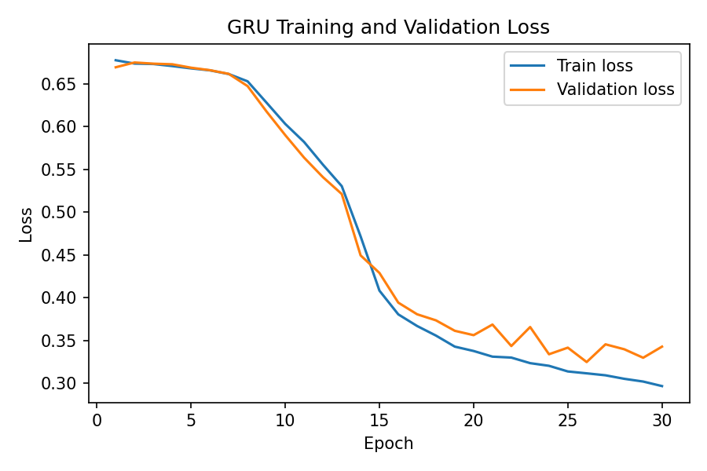

# ECG Abnormality Classification

End-to-end machine learning system for binary ECG abnormality classification, combining classical machine learning and deep learning approaches. The project is implemented as a production-ready Python package with a command-line interface (CLI) and Docker support, enabling reproducible inference on single ECG files.

---

## Project Overview

The goal of this project is to classify ECG recordings as **NORMAL** or **NOT NORMAL**. Two complementary model types are supported:

- **Logistic Regression** using handcrafted time–frequency features
- **GRU (Gated Recurrent Unit)** neural network operating on raw or minimally processed ECG signals

The project emphasizes not only model performance, but also **clean software architecture**, **reproducibility**, and **deployment-readiness**.

---

## Dataset

The models are trained on ECG data derived from **PTB-XL**, a large, publicly available clinical ECG dataset containing 12-lead recordings with expert annotations.

For this project:

- The task is simplified to **binary classification**:
  - `0 = NORMAL`
  - `1 = NOT NORMAL`
- Original multi-label diagnostic annotations are mapped to this binary target

The dataset is slighty imbalanced with approximately 57% of the samples labeled as "NOT NORMAL".

---

## Demo Data

Demo ECG files are provided as .csv and in wfdb-format. These "signals" are **synthetic and randomly generated** and are **not real patient data**.

These demo files exist solely to:

- Validate the end-to-end inference pipeline
- Test the CLI and Docker setup

They should **not** be interpreted as physiologically realistic ECGs and are **not suitable for model validation or performance claims**.

---

## Key Features

- End-to-end ML pipeline: data loading → preprocessing → training → evaluation → inference
- Multiple model backends (logistic regression and GRU)
- Model artifacts bundled with the package
- Command-line interface for inference
- Docker image for reproducible, environment-independent execution
- Clear separation between training code and inference package

---

## Repository Structure

```
ecg-classifier/
├── src/ecg_classifier/       # Python package
│   ├── cli.py                # CLI entry point
│   ├── inference.py          # Inference logic
│   ├── models/               # Model definitions (LogReg, GRU)
│   ├── io/                   # ECG loading (CSV, WFDB)
│   ├── artifacts/            # Trained model files (.joblib, .pt)
│   └── demo/                 # Synthetic demo ECG files in csv. and wfdb-format
├── scripts/                  # Training scripts and demo data generation
├── tests/                    # PowerShell-based smoke test verifying CLI functionality.
├── data/                     # Path to training data (data not included)
├── plots/                    # Model performance, training etc.
├── Dockerfile                # Docker image optimized for inference
├── pyproject.toml            # Packaging and dependencies
└── README.md
```

---

## Installation

### Local (virtual environment)

```bash
python -m venv .venv
source .venv/bin/activate  # Windows: .venv\Scripts\activate
pip install -e .
```

This installs the package in editable mode for development and testing.

---

## Running Inference

### CLI

```bash
ecg-classifier infer \
  --input path/to/ecgfile \
  --format csv \
  --model_type logreg
```

Options:

- `--input`: Path to ECG file
- `--format`: `csv` or `wfdb` (default: `wfdb`)
- `--model_type`: `logreg` or `gru` (default: `logreg`)

Output:

```
ECG classification result
-------------------------
Label      : NORMAL
Confidence : 0.87
```

---

## Docker Usage

Build the inference image:

```bash
docker build -t ecg-classifier .
```

Run inference:

```bash
docker run --rm \
  -v $path/do/user/data:/data \
  ecg-classifier infer \
  --input /data/test_ecg_12lead.csv \
  --format csv \
  --model_type gru
```

The Docker image is optimized for **inference only** and includes only the dependencies required to load and run the trained models.

---

## Model training

Model training is performed via standalone scripts and is intentionally kept **outside the package**.

Example:

```bash
pip install -e .
python -m scripts.train_logreg
python -m scripts.train_gru
```

Training outputs artifacts (e.g. `.joblib`, `.pt`) into `ecg_classifier/artifacts/` for inference.


---

## Model performance for logistic regression

The logistic regression model is trained on the training split and evaluated on a separate validation set for model comparison. Final performance is reported on a held-out test set using the same metrics as the GRU model to ensure fair comparison.

The performance on the test-set was:

**Test accuracy: 0.732**


## Training curves for GRU

The figure below shows the training and validation loss per epoch for the GRU-based ECG classifier.



- The initial loss plateau around 0.68 corresponds to a validation accuracy of approximately 57%, which matches the proportion of the “not normal” class in the dataset. At this stage, the model effectively predicts “not normal” for all samples, equivalent to a majority-class baseline.

- After approximately five epochs, the training loss begins to decrease steadily, indicating that the model starts to learn meaningful temporal patterns from the ECG signals.

- The validation loss follows a similar downward trend, suggesting that the learned representations generalize beyond the training data.

- From around epoch 24, the validation loss begins to plateau while the training loss continues to decrease, indicating the onset of overfitting.


The validation loss is used for **early stopping and model selection**.  
The saved model corresponds to the epoch with the lowest validation loss, rather than the final training epoch.

Loss curves are primarily used as a **diagnostic tool** to assess convergence behavior and overfitting, while final model performance is reported separately on a held-out test set. The performance on the test-set was:

**Test accuracy: 0.835**


## Design Principles

- Production-oriented ML system design
- Clear separation of concerns (training vs inference)
- Deterministic, reproducible inference
- Minimal, explicit dependencies


---


## Skills Demonstrated

System design for ML applications, data preprocessing and feature engineering, classical ML and deep learning, ML tooling, packaging, containerization in Docker, and production-oriented deployment practices.

---

## Future Work

This project is intentionally scoped with a primary focus on software engineering aspects of machine learning systems, including modular design, reproducibility, packaging, and deployment. Several natural extensions exist, particularly on the modeling side, which were deliberately deprioritized in favor of system-level concerns.

Potential future work includes:

- Systematic hyperparameter tuning
Both the logistic regression and GRU models could benefit from structured hyperparameter search (e.g. regularization strength, GRU hidden size, learning rate, batch size). This could be implemented via grid search or Bayesian optimization, with the existing train/validation split already supporting such workflows.

- Explicit regularization strategies
While some regularization is implicitly present (e.g. class weighting in logistic regression, early stopping in GRU training), further techniques such as L1/L2 penalties, dropout, or weight decay could be explored to improve generalization and model robustness.

- Cross-validation for classical models
For the logistic regression model in particular, k-fold cross-validation could be added to obtain more stable performance estimates and to decouple model selection more cleanly from the held-out test set.

- More advanced evaluation
While this project reports a limited set of core metrics for clarity, additional evaluation tools such as precision–recall curves or ROC AUC could be added in future work to further analyze model behavior, especially in the presence of class imbalance.


Overall, these extensions are technically straightforward within the current architecture. The existing codebase is designed to accommodate such improvements without major refactoring, underscoring the project’s emphasis on maintainable and extensible ML system design rather than exhaustive model optimization.

---


